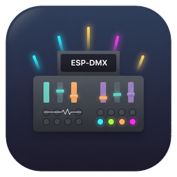

# ESP-DMX Configuration Utility  
**Professional lighting control interface**

The **ESP-DMX Configuration Utility** provides a graphical interface to remotely configure WiFi and DMX protocol parameters on ESP-DMX devices. Configuration is achieved by connecting to a target device, adjusting parameters, and uploading them as a configuration packet.  

## Downloads & Installation

The **ESP-DMX Configuration Utility** is available for all major desktop platforms:

### 🐧 Linux
- [**AppImage**](https://drive.google.com/file/d/1laCK71xpP2PaowVE3RJ9rJOASCd-aTj0) – Portable, no installation required.  
- [**.deb Package**](https://drive.google.com/file/d/1YSVIVv0ppRMB1UoA4wDpASjeQoDQpyoh) – For Debian/Ubuntu-based distributions (installs via the system package manager).

### 🪟 Windows
- [**Standalone Executable (.exe)**](https://drive.google.com/file/d/1Fqeyd0FMuJSGenbuPMxYicID-U2GnXJc) – Download and run directly.  
- [**Installer**](https://drive.google.com/file/d/1MbOHSAWno61DV-KrAqegrOIAtqYON2um) – Optional guided installation that creates Start Menu shortcuts.

### 🍎 macOS

The utility is available in multiple formats to support different architectures and user preferences:

- **Universal Build**  
  - Runs on both **Intel (x64)** and **Apple Silicon (ARM)** Macs.  
  - Available as:  
    - `.dmg` – Drag-and-drop installation  
    - `.zip` – Standalone `.app` bundle (no installation required)

- **Apple Silicon (ARM)**  
  - Optimized for Apple M-series processors.  
  - Available as:  
    - `.dmg` – Drag-and-drop installation  
    - `.zip` – Standalone `.app` bundle

- **Intel (x64)**  
  - Optimized for Intel-based Macs.  
  - Available as:  
    - `.dmg` – Drag-and-drop installation  
    - `.zip` – Standalone `.app` bundle

> 📝 **Tip:** If macOS displays a security warning for unidentified developers, you can allow the app to run via **System Settings → Privacy & Security**.

## Device Management
**Tab: Device**

### Device Connection

This section allows discovery and connection to ESP-DMX devices on your network.

- **Target IP Address**  
  Enter the IP address of the device or use a broadcast address (e.g., `10.255.255.255`) to search.

- **🔄 Refresh**  
  Scans the network for available ESP-DMX devices.  
  Once the scan completes, any detected devices are listed in the **device dropdown menu**, allowing quick selection without manually entering IP addresses.

- **Device Dropdown List**  
  Displays all discovered devices after a refresh scan. Selecting a device from the list automatically fills the Target IP field.

- **Discover Device**  
  Connects to the **selected Target IP** and **downloads the current configuration** from the device. This allows you to view and modify existing network and protocol settings.

- **Connection Status**  
  Displays whether the utility is successfully connected to a device.

Once connected, the device is ready to accept configuration uploads.

### Configuration Management

- **Upload Configuration**  
  Sends current settings (WiFi + DMX) to the connected device.

> 🔁 **Note:** After uploading new settings, the **device must be restarted** for changes to take effect.

### Art-Net Specific Commands
When using the **Art-Net protocol**, additional protocol-specific controls are available:

- **Cancel Merge**  
  Stops an ongoing Art-Net merge process.  

- **Clear Output**  
  Resets Art-Net output data.  

## WiFi & IP Configuration
**Tab: Network**

### WiFi Configuration
Define how the device connects to wireless networks:

- **Network Name (SSID)**: Enter the WiFi SSID.  
- **Password**: Enter the WiFi password.  
- **Connection Mode**:  
  - **Station Mode**: Connects to an existing WiFi network.  
  - **Access Point Mode (AP Mode)**: Creates its own WiFi network (fallback if station connection fails).  

### IP Configuration
Configure addressing for either Station or AP mode:

- **Use Static IP**: Option to disable DHCP and set a manual IP.  
- **Access Point Settings**:  
  - **AP IP Address**  
  - **AP Gateway**  
  - **AP Subnet Mask**  

> 🔒 **Note:** For security reasons, the **WiFi password is never transmitted back** from the device to the configuration utility. It is stored securely on the device and only sent during configuration uploads.

## Protocol Configuration
**Tab: Protocol**

Configure DMX protocol parameters and network transport options.

### Protocol Selection
- **Art-Net (Port 6454)** – Industry-standard Ethernet lighting protocol.  
- **sACN (E1.31, Port 5568)** – ESTA streaming protocol.  
- **Data Direction** – Select input (receive from console).  

### Network Mode
Defines how DMX data is distributed:  
- **Broadcast** – Sends to all devices on the network.  
- **Multicast** – Sends to a specific group address.  
- **Multicast IP Address** – Address for multicast mode.  
- **Network Target** – Defines broadcast/unicast target.  

### Universe Configuration
- **Art-Net Subnet**: 0–15  
- **Art-Net Universe**: 0–15  
- **Node Name**: Custom device identifier.  
- **RDM Support**: Enable/disable Remote Device Management protocol.  

## Fallback Logic
To guarantee device accessibility:  
1. On startup, the ESP-DMX tries to connect in **Station Mode** using the last known SSID and password.  
2. If unsuccessful, it automatically switches to **Access Point Mode** with default credentials.  
3. From AP mode, a computer can connect and reconfigure WiFi or DMX settings.  

## Typical Workflow
1. **🔄 Refresh** to scan for devices.  
2. Select a device from the dropdown.  
3. Click **Discover Device** to connect and download its configuration.
4. Go to **Network** → configure WiFi and IP settings.  
5. Go to **Protocol** → set DMX protocol, universe, and network transport.  
6. Return to **Device** → **Upload Configuration**.  
7. 🔁 **Restart the device** to apply changes.
